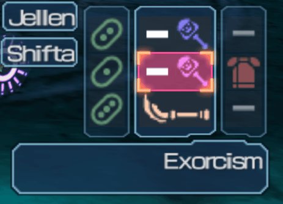
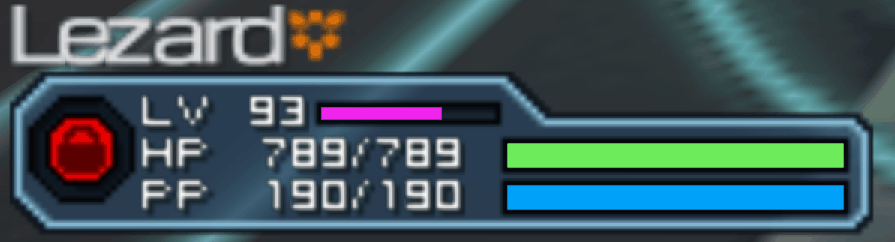

## Description
Fan-made high resolution texture pack for Phantasy Star Portable 2 Infinity

__Meant for use with PPSSPP emulator__

## Showcase

  
GIF images

  
  
  
  

## Important
I would ask that you do not create mirrors, re-packs, edits, and that you do not include any file from this project in another project. Thank you.

If you want to publish a link to this project please link to the main page of the repository not to the releases section.

  
Resolution / Screen Size / Emulator Quirks

  
Current release(s) target the following settings (on a 1920x1080 screen) :

Full Screen Mode : On

Internal resolution : 4x

Screen Size : 4x

Screen Scaling : Nearest Neighbor

Texture Scaling - Upscale level : Off

As a rule of thumb try to keep Internal Resolution and Screen Size equal. PPSSPP doesn't seem to be currently able to handle InternalRes > ScreenSize gracefully, in my testing I noticed visible artifacts and also had issues with InternalRes < ScreenSize.

If you really must mismatch InternalRes and ScreenSize then you could try setting Screen Scaling to Linear.

## How to download

Click on the link : [Latest Release](https://github.com/eleriaqueen/pspo2i-hr-ui/releases/latest) and download the available release zip file.

## How to install

    
If you have no other PSPo2i texture pack

  
1 - Create a folder called "Textures" inside your "PSP" folder.

2 - Extract the latest release inside "Textures" folder.

3 - Boot up PPSSPP and go to Settings->Tools->Developer Tools->Replace Textures. Make sure this is checked !

3a - Unless you know what you're doing, option "Save New Textures" should not be checked. (It significantly degrades performance)

3b - You can map "Texture Replacement" function to a key to compare the original UI to the high-res one at the press of a button.

4 - Voilà, have fun!

    
If you're using Rozalin's "PSPo2i Texture Restoration" pack

  
1 - You should already have a folder called "Textures", inside it should be a folder called "NPJH50332".

2 - Open the latest release file and extract the folder called "HighRes-UI" to __your__ "NPJH50332" folder.

3 - Open "textures.ini" from the "HighRes-UI" zip file. You'll need to copy all text which is found after "[Hashes]".

4 - Open __your__ "textures.ini" (containing entries related to Rozalin's texture pack). Paste what you copied in the previous step, either right after "Hashes" or at the bottom of the file. 

4a - Don't forget to save "textures.ini" when you're finished editing it.

5 - Enjoy !

## Troubleshooting

    
Why does this or that texture pack stop working after updating one of them ?

Everytime either Rozalin or I add a file to either of our project we have to modify our "textures.ini" file which means we potentially include an updated one with a new release.

An issue often arises when one overwrites their current ini file with one from a texture pack they want to update.

As long as PPSSPP does not support multiple ini files per game (one for each texture pack) the user needs to merge them.

    
How to cleanly update either PSPo2i texture pack

1 - Make sure you grab latest Rozalin's latest "Texture Restoration" pack

2 - Clean up your NPJH50332 folder from any texture pack (that means delete all previously installed textures and "textures.ini")

3 - Install the "Texture Restoration" pack in full

4 - Make sure you grab my latest "HighRes-UI" pack

5 - Install the "HighRes-UI" textures folder __but not the ini__

5 - Merge both ini files (that is to say copy text found after "Hashes" in latest "HD UI" ini and paste it into the "Textures Restoration" ini that you installed)

6 - And that's it.

## Found an issue ?
Post in the [Issues](https://github.com/eleriaqueen/pspo2i-highres-ui/issues) section, please make the report as detailed as possible so that I may fix whatever needs fixing.

If possible, include picture(s) which illustrate the issue.

Snipping Tool / Snip & Sketch comes bundled with Windows and it is very useful for that purpose.

## My Thanks go to
__Rozalin__ for testing, reporting issues and more.

__Pixiv artist ひなふ__ for some of their high resolution pieces of art that were used as models.

__SEGA__ and __SONIC TEAM__ for making Phantasy Star Universe as their art was often used as reference.

__SEGA__ and __Alfa System__ for publishing and developing Phantasy Star Portable 2 Infinity respectively.

__PSPo2i English Translation Team__ including but not limited to JamRules.
